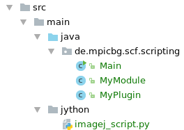
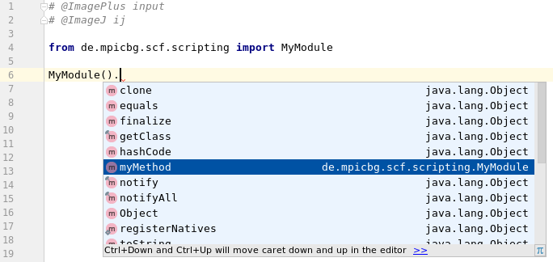
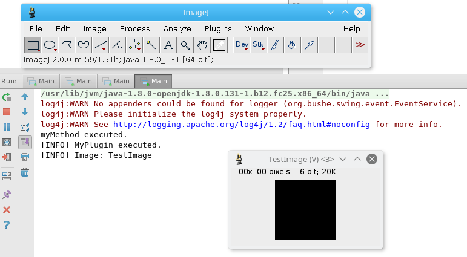

## How to run ImageJs Jython Scripts from within an IDE

Did you ever work on a Jython script for ImageJ and in parallel on a Java based ImageJ Plugin?
This is a bit anoying, right? After every change in the Java code, you need to deploy the jar file to your ImageJ/Fiji installation and restart ImageJ.

With ImageJ2, there is a way to edit Jython scripts and Java code in parallel and run it together with a single click!

But one step after the other. Let's start with the used IDE. In principle, I guess the following will work with any IDE such as Eclipse or Intellij. I tested with Intellij 2017.01 with Python support installed.

The project we are talking about looks like this:



# MyPlugin.java
This is the minimal ImageJ2 plugin I'm using to demonstrate the proof of concept:

```Java
@Plugin(type = Command.class, menuPath = "Plugins>MyPlugin")
public class MyPlugin implements Command {
    @Parameter
    ImagePlus input;

    @Parameter
    ImageJ ij;

    @Override
    public void run() {
        ij.log().info("MyPlugin executed.");
        ij.log().info("Image: " + input.getTitle());
    }
}
```

# MyModule.java
Furthermore, a minimal Java Class should allow us later to show the capabilities of the IDEs auto completion functionality:

```Java
public class MyModule {
    public void myMethod() {
        System.out.println("myMethod executed.");
    }
}
```

# imagej_script.py
This is the actual ImageJ jython script

```python
# @ImagePlus input
# @ImageJ ij
from de.mpicbg.scf.scripting import MyModule

# work with classes and methods from java directory
MyModule().myMethod()

# execute a plugin
from ij import IJ;
input.show()
IJ.run(input, "MyPlugin", "")
```

When writing it, I already saw that my IDE allows auto completion:



Isn't that awesome?

# Main.java

Last but not least: How do we run the jython script from within the IDE? The answer is the `ScriptingService` of ImageJ2.
The whole main function which runs ImageJ, creates a test image and calls the script looks like this:

```Java
public class Main {
    public static void main(String... args) throws FileNotFoundException, ScriptException {
        // start ImageJ
        ImageJ ij = new ImageJ();
        ij.ui().showUI();

        // get some image to process
        Img<ShortType> testImage = ArrayImgs.shorts(new long[]{100, 100});
        ImagePlus imp = ImageJFunctions.wrap(testImage, "TestImage");

        // run the script, hand over image and imagej instances
        ij.script().run(new File("src/main/jython/imagej_script.py"), false, new Object[]{"input", imp, "ij", ij});

    }
}
```

And the output together with the opening windows look like that:



Thus, finally I will spare a lot of deployment time in the future.

Feedback welcome: rhaase@mpi-cbg.de

Happy coding!